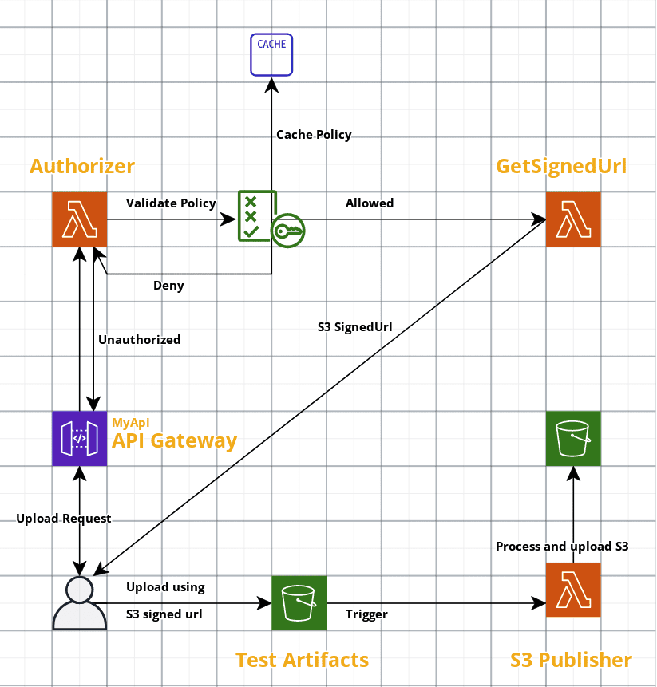

# S3 Publisher


[](https://github.com/simorgh1/s3-publisher/blob/main/LICENSE)
[](https://github.com/simorgh1/s3-publisher/stargazers)
[](https://github.com/simorgh1/s3-publisher/actions?query=workflow%3Apre-commit+branch%3Amain)
[](https://github.com/simorgh1/s3-publisher/actions?query=workflow%3ACodeQL+branch%3Amain)


Stargaze  if you find it useful.

Provides infrastructure for uploading multiple artifacts to S3 bucket using signed url, that could be processed and uploaded to a defined target.

## Overview

This Application is designed to leverage the Serverless architecture by using the AWS Lambda functions and HttpApi which uses an Authorizer for Client authentication.

The communication flow is based on a decoupled design so that the Lambda function for uploading the test artifacts is not directly used. Instead, after a successful client authentication, an S3 signed Url is generated that is used to upload the artifacts.

### Process Workflow



## System Requirements

- Docker
- VS Code
- AWS Cli ([configured](https://docs.aws.amazon.com/cli/latest/userguide/cli-configure-quickstart.html))

Already in Dev Container:

- Python 3.9
- NodeJs 16.x
- AWS [SAM](https://aws.amazon.com/serverless/sam/)
- jq
- pre-commit
- black

AWS Serverless Application Model was used to design, build and deploy this application which uses Lambda function, HttpApi and S3 buckets.

SAM infrastructure as code template is inherited from CloudFormation and the current template is used to deploy all infrastructure used by this application.

## Dev Container

After cloning the git repository, open the folder in VS Code and if docker is running, it asks you to open the workspace in [Dev Container](https://code.visualstudio.com/docs/remote/containers).

All required tools are already installed in the Dev Container, and you could start working.

## Deployment

For deploying the application in a new environment, you should package and publish the application to sam s3 bucket once, after that all subsequent build and deployments could be applied using related sam commands.

Using **deploy.sh** script, it would validate the sam template, build and deploy it to the configured aws region. It also adds the missing lambda notification.

After deployment, please configure the environment variables for the authorizer and publish artifacts lambda functions.

## Test

For testing the functionality, switch to the test folder and run *upload-log.py* command, it will get the api endpoint url, pack both log files, then authenticate the client and get the signed url for uploading the packed file to s3 bucket.

The idea of this solution is, since S3 supports only a single file per upload, we pack our files, in this example 2 files as tar.gz and upload them to S3 where it will be unpacked and processed by *publishArtifacts* lambda function.

Please update the authorization environment variable according to the environment value you set in the authorizer function. For more information, look into the *AuthorizerAPIKey* variable in the sam template.

```python
/workspaces/s3-publisher/app/test (main) $ python3 upload-log.py test-log1.xml test-log1.json
```

### Local testing keyAuthorizer

```bash
/workspaces/s3-publisher (main) $ sam local invoke ApiKeyAuthorizer -e keyAuthorizer/requestEvent.json -n keyAuthorizer/env.json
```

### Local testing getSignedURL

```bash
/workspaces/s3-publisher (main) $ sam local invoke UploadRequest
```

## Cleanup

In order to remove all created aws resources during deployment, run the following command in app folder

```bash
/workspaces/s3-publisher (main) $ sam delete
```

## Code formatting

Automatic Code formatting is done using [pre-commit](https://pre-commit.com) hooks.

pre-commit manages all of your hooks using a yaml config file: _.pre-commit-config.yaml_

When you run git commit command, it will first execute the configured pre-commit hooks for the staged files.
